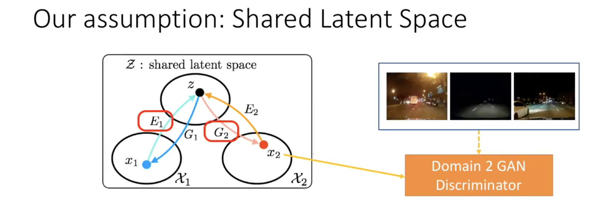
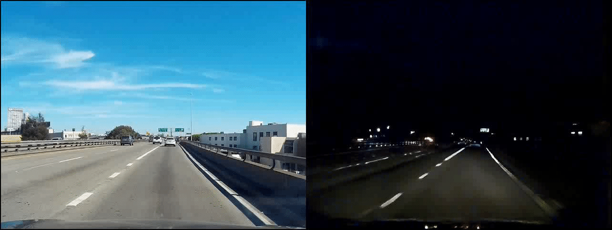
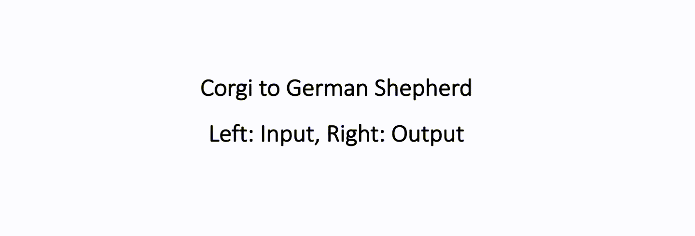
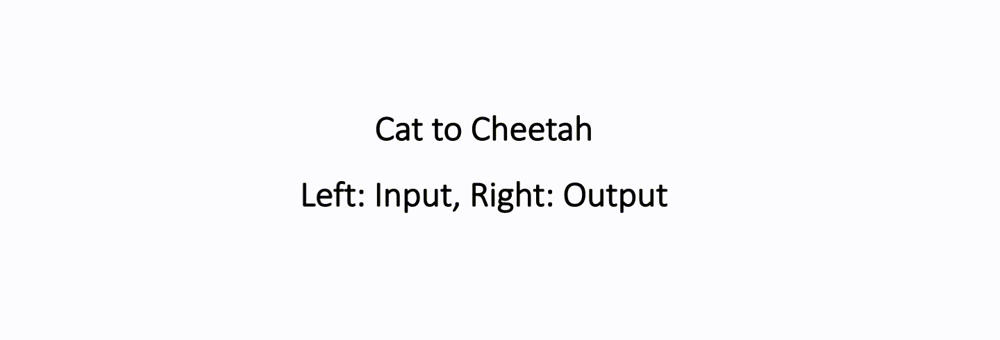

### Preliminaries

* **Step 1**. Create a conda environment with Python 3.8 and activate it.
~~~shell
conda create --name UNIT python=3.8 -y
conda activate UNIT
~~~

* **Step 2.** Install PyTorch with TorchVision following [official instructions](https://pytorch.org/get-started/locally/). The below is an example. We do not recommend PyTorch 2.x for our code.
~~~shell
pip install torch==1.13.0+cu117 torchvision==0.14.0+cu117 torchaudio==0.13.0 --extra-index-url https://download.pytorch.org/whl/cu117
~~~

* **Step 3.** Install some libraries
~~~shell
conda install -y -c anaconda pip
conda install -y -c anaconda pyyaml
pip install tensorboard tensorboardX
~~~

  
### Train a model:
You can use the following commands to train a model from the dataset.
~~~shell
python train.py \
    --config "$CONFIG" \
    --output_path "$OUTPUT_FOLDER" \
    --trainer UNIT
~~~

### I2I Translation with model checkpoint:
You can use the following commands to translate a image from the dataset.
~~~shell
python test.py \
      --trainer UNIT \
      --config "$CONFIG" \
      --input "$img" \
      --output_folder "$OUTPUT_FOLDER" \
      --checkpoint "$CHECKPOINT" \
      --a2b 1 \
      --output_only
~~~

### Using Bash Shell Script 

Batch Inference (Image Translation)
~~~bash
bash transfer.sh
~~~

## UNIT: UNsupervised Image-to-image Translation Networks

## New implementation available at imaginaire repository

We have a reimplementation of the UNIT method that is more performant. It is avaiable at [Imaginaire](https://github.com/NVlabs/imaginaire)

### License

Copyright (C) 2018 NVIDIA Corporation.  All rights reserved.
Licensed under the CC BY-NC-SA 4.0 license (https://creativecommons.org/licenses/by-nc-sa/4.0/legalcode). 

### Code usage

-  Please check out our [tutorial](TUTORIAL.md). 

-  For multimodal (or many-to-many) image translation, please check out our new work on  [MUNIT](https://github.com/NVlabs/MUNIT).

### What's new.

- 05-02-2018: We now adapt [MUNIT](https://github.com/NVlabs/MUNIT) code structure. For reproducing experiment results in the NIPS paper, please check out [version_02 branch](https://github.com/mingyuliutw/UNIT/tree/version_02).

- 12-21-2017: Release pre-trained synthia-to-cityscape image translation model. See [USAGE.md](TUTORIAL.md) for usage examples.

- 12-14-2017: Added multi-scale discriminators described in the [pix2pixHD](https://arxiv.org/pdf/1711.11585.pdf) paper. To use it simply make the name of the discriminator COCOMsDis.

### Paper

[Ming-Yu Liu, Thomas Breuel, Jan Kautz, "Unsupervised Image-to-Image Translation Networks" NIPS 2017 Spotlight, arXiv:1703.00848 2017](https://arxiv.org/abs/1703.00848)

#### Two Minute Paper Summary
 (We thank the Two Minute Papers channel for summarizing our work.)

#### The Shared Latent Space Assumption

#### Result Videos

More image results are available in the [Google Photo Album](https://photos.app.goo.gl/5x7oIifLh2BVJemb2).

*Left: input.* **Right: neural network generated.** Resolution: 640x480

*Left: input.* **Right: neural network generated.** Resolution: 640x480

- [Snowy2Summery-01](https://youtu.be/9VC0c3pndbI)
- [Snowy2Summery-02](https://youtu.be/eUBiiBS1mj0)
- [Day2Night-01](https://youtu.be/Z_Rxf0TfBJE)
- [Day2Night-02](https://youtu.be/mmj3iRIQw1k)
- [Translation Between 5 dog breeds](https://youtu.be/3a6Jc7PabB4)
- [Translation Between 6 cat species](https://youtu.be/Bwq7BmQ1Vbc)

#### Street Scene Image Translation
From the first row to the fourth row, we show example results on day to night, sunny to rainy, summery to snowy, and real to synthetic image translation (two directions). 

For each image pair, *left is the input image*; **right is the machine generated image.**

#### Dog Breed Image Translation

#### Cat Species Image Translation

#### Attribute-based Face Image Translation

